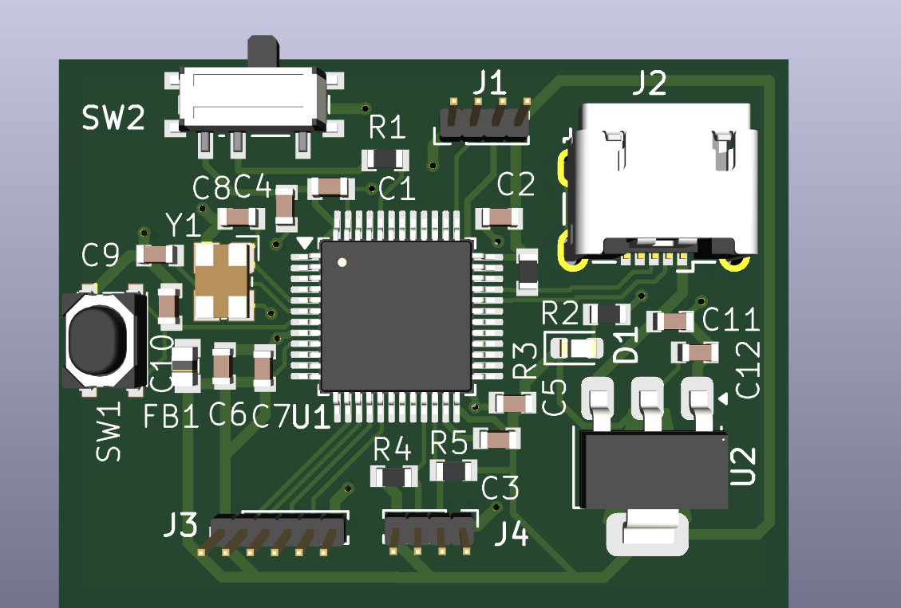
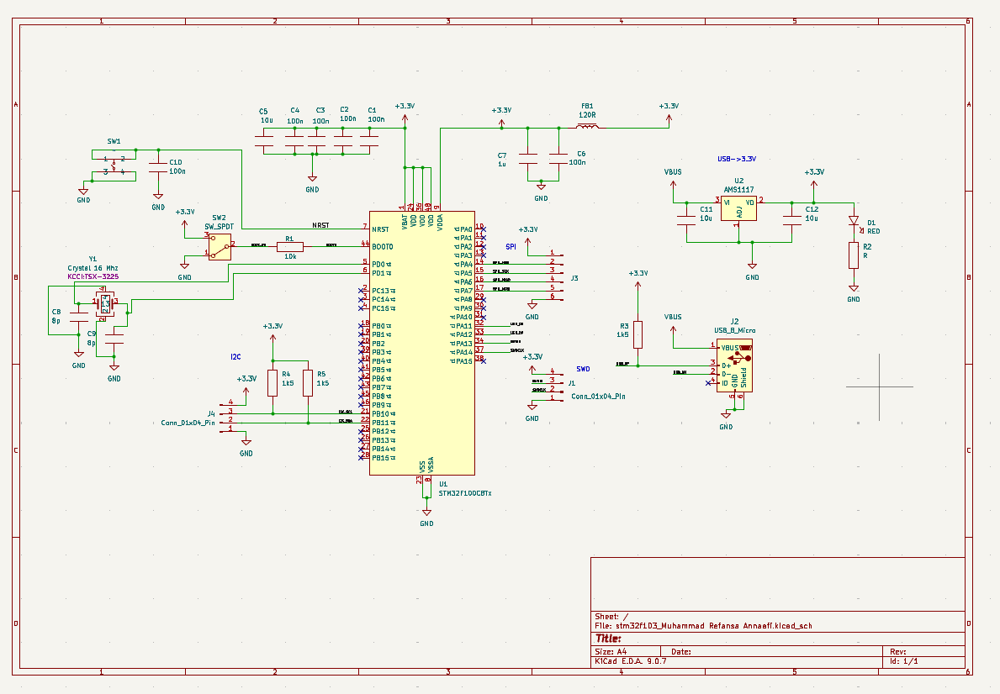
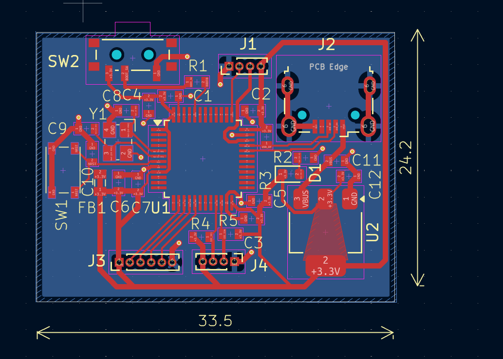

# STM32F103 Minimal Development Board

A compact 2-layer STM32F103 (LQFP-48) breakout board designed in **KiCad 9**. It is powered over USB and exposes SWD, SPI and I2C on pin headers.



## Features

- **MCU:** STM32F1 in LQFP-48 (U1). The schematic uses the KiCad `STM32F100C8Tx` symbol, which has the same LQFP-48 pinout used for an STM32F103C8T6.
- **Clock:** 16 MHz crystal (TSX-3225) with 8 pF load capacitors
- **Power:** USB Micro-B → AMS1117-3.3 LDO → 3.3 V, with a ferrite bead (120 Ω) filtering VDDA
- **USB:** D+ pull-up (1k5) on PA12
- **Boot mode:** slide switch (SW2) on BOOT0
- **Reset:** tactile button (SW1) on NRST
- **Power LED:** red LED (D1)
- **Headers:**
  - `J1`: SWD (3V3, SWDIO, SWCLK, GND)
  - `J3`: SPI1 (3V3, NSS, SCK, MISO, MOSI, GND)
  - `J4`: I2C1 on PB10/PB11 with 1k5 pull-ups
- **Board:** about 33.5 × 24.2 mm, 2 layers, 1.6 mm thick, all components on the top side

## Schematic



## PCB Layout



## Repository Structure

```
.
├── stm32f103_Muhammad Refansa Annaafi.kicad_pro   # KiCad project
├── stm32f103_Muhammad Refansa Annaafi.kicad_sch   # Schematic
├── stm32f103_Muhammad Refansa Annaafi.kicad_pcb   # PCB layout
├── Gerber/    # Fabrication outputs (Gerbers, drill files, job file)
├── BOM/       # Bill of materials (CSV)
└── Media/     # Screenshots and renders
```

## Bill of Materials

| Ref | Value | Footprint | Qty |
|---|---|---|---|
| U1 | STM32F1 (LQFP-48) | LQFP-48_7x7mm_P0.5mm | 1 |
| U2 | AMS1117-3.3 | SOT-223-3 | 1 |
| Y1 | 16 MHz crystal | TSX-3225 | 1 |
| J2 | USB Micro-B | Würth 629105150521 | 1 |
| FB1 | 120 Ω ferrite bead | BLM18PG121SN1D (0603) | 1 |
| C1–C4, C6, C10 | 100 nF | 0603 | 6 |
| C5, C11, C12 | 10 µF | 0603 | 3 |
| C7 | 1 µF | 0603 | 1 |
| C8, C9 | 8 pF | 0603 | 2 |
| R1 | 10 kΩ | 0603 | 1 |
| R3, R4, R5 | 1.5 kΩ | 0603 | 3 |
| R2 | LED resistor | 0603 | 1 |
| D1 | Red LED | 0603 | 1 |
| SW1 | Tactile switch | 434133025816 | 1 |
| SW2 | SPDT slide switch | PCM12 | 1 |
| J1, J4 | 1×4 header | 1.00 mm pitch | 2 |
| J3 | 1×6 header | 1.00 mm pitch | 1 |

The full BOM is in [`BOM/`](BOM).

## Manufacturing

Upload the contents of [`Gerber/`](Gerber) to a PCB fab such as JLCPCB or PCBWay. It includes the copper, mask, paste, silkscreen and edge-cut layers, plus the PTH/NPTH drill files.

## Opening the Project

Open the `.kicad_pro` file in KiCad 9.0 or newer. The project uses a custom `KCCI` symbol/footprint library for some parts (for example the crystal). If those parts show up as missing, add that library to your library tables.

## Author

Muhammad Refansa Annaafi. Designed as part of the KCCI PCB design training.
